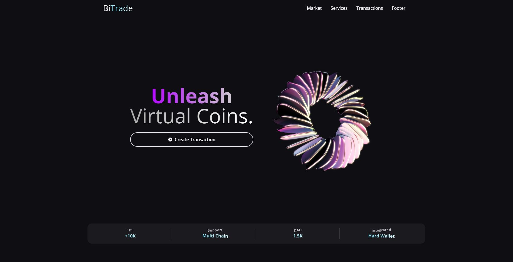

# BiTrade

## Overview

BiTrade is a decentralized application that allows users to send cryptocurrency to any address by connecting their MetaMask wallet. The front end is built using React.js, while the backend utilizes Solidity and Hardhat for smart contract development and deployment.

## Features

- Connect MetaMask wallet for secure transactions.
- Send cryptocurrency to any address easily.
- Real-time transaction updates and notifications.
- Secure and decentralized transaction processing.

## Technologies Used

### Front End

- 
- 
- 
- 
- 
- 

### Back End

- 
- 

### Wallet Integration

- 
